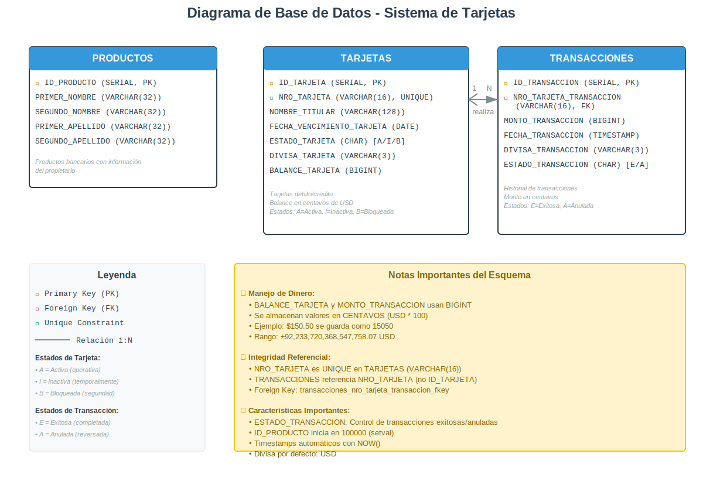

# BANK INK
🎯 PRUEBA DE DESARROLLO BACKEND

Este proyecto tiene como fin cumplir los siguientes criterios de evaluación: 

Bank Inc es una empresa que permite asignar a sus clientes una tarjeta débito o
crédito para realizar compras en los comercios asociados. Dicha tarjeta cuenta
con las siguientes características:
        
    • Tiene una longitud de 16 dígitos, donde los 6 primeros dígitos corresponden al id del producto y los demás son aleatorios.
    • Nombre del titular de la cuenta (Primer nombre y apellido)
    • Fecha de vencimiento (mm/aaaa) de 3 años posterior a la fecha de creación.
    • Permite únicamente movimiento en dólares.
        
Cada vez que se requiera una nueva tarjeta el banco debe realizar un proceso de emisión de tarjeta, el cual consta de los siguientes pasos:

    1. A partir del identificador de producto, generar el número de tarjeta.
    2. Se debe realizar la activación de la tarjeta, ya que por controles de seguridad estan inactivas.
    3. El saldo de dicha tarjeta es de cero pesos, por lo tanto, debe poderse hacer una recarga de saldo.

Una vez Bank Inc haga su proceso de emisión, la tarjeta estará disponible para
realizar compras teniendo en cuenta que:
    • Se debe contar con el saldo suficiente para realizar la compra (el saldo disponible no debe ser menos a cero).
    • Debe estar vigente, es decir, la fecha de la transacción no debe ser mayor a la fecha de vencimiento.
    • La tarjeta debió ser activada en el proceso de emisión
    • La tarjeta no debe estar bloqueada, este es un proceso que realizan los administradores del sistema cuando encuentran alguna inconsistencia.

Al realizar una transacción de compra, el sistema asignará un identificador con el
cual es posible consultar la transacción o realizar la anulación.

## Diagrama DB propuesto 

## Endpoints disponibles
A continuación se listan los endpoints disponibles, para mas información acerca de los mismos revisar la documentación del proyecto, disponible en swagger al ejecutarlo o al consumirlo en nube.

    • GenerarNumeroTarjeta  --> /card/{productId}/number
    • ActivarTarjeta        --> /card/enroll
    • BloquearTarjeta       --> /card/{cardId}
    • RecargarBalance       --> /card/balance
    • ConsultarBalance      --> /card/balance/{cardId}

    • ObtenerTransaccion      --> /transaction/{transactionId}
    • RealizarTransaccion      --> /transaction/purchase
    • AnularTransaccion      --> /transaction/anulation
    

# Pasos para realizar despliegue local

## 1. Clonar el proyecto 

## 2. Ejecutar el archivo Dockerfile

Se debe ejecutar el comando __docker build -t bankink-ms:1.0.0 .__ para crear la imagen contenedor para el backend

## 3. Ejecutar docker compose
Una vez generada la imagen bankink-ms:1.0.0 se debe ejecutar el comando __docker compose up --build__ para crear y ejecutar los contenedores de la db y el backend.

__NT:__ Se debe crear un archivo .env y situarlo al mismo nivel del archivo __docker-compose. yml__, dicho archivo debe contener las variables: 

 - ARG_DB_URL --> Corresponde a la URL de conexión JDBC
 - ARG_DB_USER --> Usuario de la db que manejará las transacciones
 - ARG_DB_PASS --> Contraseña del usuario de la db
 - ARG_DB_NAME --> nombre de la db

 A continuación se muestra un ej de cómo debería verse el archivo: 

    ARG_DB_URL=jdbc:postgresql://postgres:5432/bankinkdatabase?options=-c%20TimeZone=AmericaBogota
    ARG_DB_USER=devuser
    ARG_DB_PASS=devpass
    ARG_DB_NAME=bankinkdatabase

# Cómo probar el despliegue local

Una vez arriba los contenedores de backend y la db es posible probar los servicios del API rest mediante postman en host local y en el puerto 8080

# Cómo probar el despliegue en nube

Es posible probar los servicios del API rest mediante postman del servicio en nube mediante el host y puerto 8080

